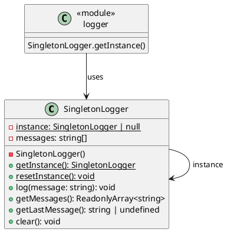

# 第 13 章 Singleton ― インスタンスを一つに制限する

## はじめに

Singleton パターンは、クラスのインスタンスが1つだけ存在することを保証し、グローバルなアクセスポイントを提供するパターンです。TypeScript では `private constructor` を使って言語レベルで制約を課すことができます。

## パターンの構造



## TDD で作る

### Red: 同一インスタンス保証テスト

```typescript
it('getInstance は常に同一のインスタンスを返す', () => {
  const a = SingletonLogger.getInstance();
  const b = SingletonLogger.getInstance();
  expect(a).toBe(b);
});
```

### Green: private constructor の実装

```typescript
export class SingletonLogger {
  private static instance: SingletonLogger | null = null;
  private constructor() {}
  static getInstance(): SingletonLogger {
    if (SingletonLogger.instance === null) {
      SingletonLogger.instance = new SingletonLogger();
    }
    return SingletonLogger.instance;
  }
}
```

### Refactor

- `resetInstance()` をテスト用に追加し、テスト間の独立性を確保
- `ReadonlyArray<string>` で外部からのメッセージ配列の変更を防止
- モジュールレベルの `logger` 定数もエクスポートし、簡便なアクセス手段を提供

## JavaScript との比較

| 観点 | JavaScript | TypeScript |
|:---|:---|:---|
| private constructor | なし（慣例的に `_` プレフィックス） | `private constructor()` で言語サポート |
| モジュール Singleton | ES Module のキャッシュで自然に実現 | 同上 + `private constructor` で明示的 |
| ReadonlyArray | なし | `ReadonlyArray<T>` で不変性保証 |

## まとめ

| 項目 | 内容 |
|:---|:---|
| 意図 | クラスのインスタンスを一つに制限し、グローバルアクセスポイントを提供する |
| 変わらないもの | インスタンスの一意性 |
| 変わるもの | インスタンスの状態（ログメッセージ等） |
| TypeScript の利点 | `private constructor` で不正な `new` をコンパイル時に防止。`ReadonlyArray` で不変性保証 |
| 注意点 | テスタビリティへの影響。グローバル状態はテスト間の干渉を招く |
