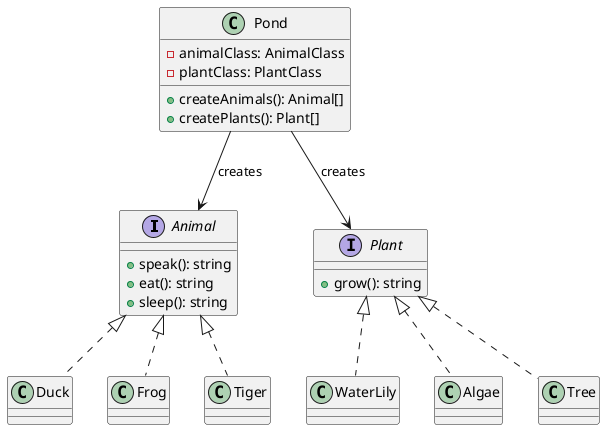
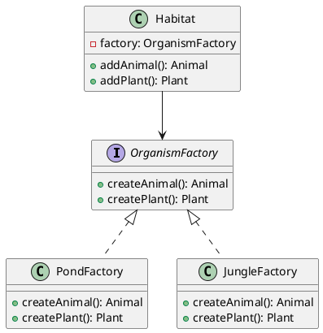

# 第 14 章 Factory ― オブジェクト生成を抽象化する

## はじめに

Factory パターンは、オブジェクトの生成を抽象化し、クライアントが具体的なクラスを知らなくても適切なオブジェクトを取得できるようにするパターンです。本章では Factory Method と Abstract Factory の2つのバリエーションを扱います。

## パターンの構造

### Factory Method



### Abstract Factory



## TDD で作る

### Red: Factory Method テスト

```typescript
it('Pond はクラス参照からアニマルを生成する', () => {
  const pond = new Pond(Duck, 3, WaterLily, 2);
  const animals = pond.createAnimals();
  expect(animals).toHaveLength(3);
  expect(animals[0].speak()).toBe('Quack!');
});
```

### Green: クラス参照を使った Factory Method

```typescript
type AnimalClass = new () => Animal;
class Pond {
  constructor(private animalClass: AnimalClass, ...) {}
  createAnimals(): Animal[] {
    return Array.from({ length: this.numberOfAnimals }, () => new this.animalClass());
  }
}
```

### Abstract Factory テスト

```typescript
it('JungleFactory は Tiger と Tree を生成する', () => {
  const habitat = new Habitat(new JungleFactory());
  const animal = habitat.addAnimal();
  expect(animal.speak()).toBe('Roar!');
});
```

### Refactor

- `interface OrganismFactory` で Factory のプロトコルを型安全に定義
- `ReadonlyArray` で `Habitat` の内部コレクションの不変性を保証
- `type AnimalClass = new () => Animal` でコンストラクタ型を定義

## JavaScript との比較

| 観点 | JavaScript | TypeScript |
|:---|:---|:---|
| コンストラクタ型 | なし | `new () => Animal` で型付き |
| Factory インターフェース | 暗黙的 | `interface OrganismFactory` で明示 |
| Product の型安全性 | なし | `Animal`, `Plant` インターフェースで制約 |

## まとめ

| 項目 | 内容 |
|:---|:---|
| 意図 | オブジェクト生成をカプセル化し、クライアントを具体クラスから独立させる |
| Factory Method | クラス参照を渡して生成を委ねる。変わるもの: 生成するクラス |
| Abstract Factory | 関連するオブジェクト群の生成を抽象化。変わるもの: Factory の実装 |
| TypeScript の利点 | コンストラクタ型 `new () => T` と `interface` で型安全なファクトリ |
| 注意点 | Factory の数が増えすぎないように。必要なときに導入する |
