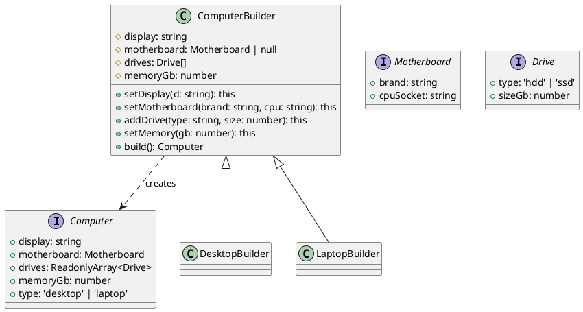

# 第 15 章 Builder ― 複雑なオブジェクトを段階的に構築する

## はじめに

Builder パターンは、複雑なオブジェクトの構築手順を分離し、同じ構築プロセスで異なる表現を生成するパターンです。メソッドチェーンとバリデーションを組み合わせ、型安全な構築を実現します。

## パターンの構造



## TDD で作る

### Red: バリデーションテスト

```typescript
it('Motherboard なしだとエラーになる', () => {
  expect(() =>
    new ComputerBuilder().addDrive('ssd', 256).setMemory(8).build()
  ).toThrow('Motherboard is required');
});
```

### Green: build() でバリデーション

```typescript
build(): Computer {
  if (!this.motherboard) throw new Error('Motherboard is required');
  if (this.drives.length === 0) throw new Error('At least one drive is required');
  if (this.memoryGb <= 0) throw new Error('Memory must be greater than 0');
  return { display: this.display, motherboard: this.motherboard, ... };
}
```

### Refactor

- `this` を返すメソッドチェーンで流暢な API を実現
- `DesktopBuilder` と `LaptopBuilder` でデフォルト値を設定
- `ReadonlyArray<Drive>` で構築後の不変性を保証
- Union Type `'hdd' | 'ssd'` でドライブ種別を型レベルで制限

## JavaScript との比較

| 観点 | JavaScript | TypeScript |
|:---|:---|:---|
| メソッドチェーンの型 | `any` | `this` 型でサブクラスでも正しい型を返す |
| バリデーション | 実行時のみ | 型レベル（Union Type）+ 実行時バリデーション |
| 生成物の不変性 | なし | `Readonly`, `ReadonlyArray` で保証 |

## まとめ

| 項目 | 内容 |
|:---|:---|
| 意図 | 複雑なオブジェクトの構築を段階的に行い、構築と表現を分離する |
| 変わらないもの | 構築手順のプロトコル |
| 変わるもの | 構築されるオブジェクトの表現（Desktop / Laptop） |
| TypeScript の利点 | `this` 型によるメソッドチェーン、Union Type による型制限、`Readonly` による不変性 |
| 注意点 | Builder が複雑になりすぎないように。必須パラメータは constructor で受け取ることも検討 |
