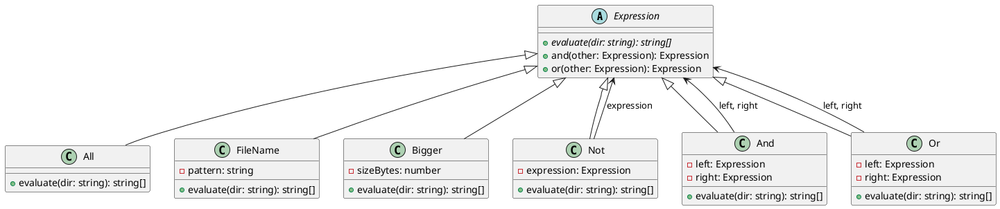

# 第 16 章 Interpreter ― 言語を解釈する

## はじめに

Interpreter パターンは、言語の文法規則をクラス階層で表現し、文を解釈・実行するパターンです。ファイル検索の DSL（ドメイン固有言語）を例に、式の組み合わせによる柔軟な条件指定を実装します。

## パターンの構造



## TDD で作る

### Red: 複合条件テスト

```typescript
it('And は両方の条件に一致するファイルを返す', () => {
  const expr = new FileName('*.txt').and(new Bigger(100));
  const result = expr.evaluate(tmpDir);
  expect(result).toEqual(['big.txt']);
});
```

### Green: 式の評価

```typescript
abstract class Expression {
  abstract evaluate(dir: string): string[];

  and(other: Expression): Expression {
    return new And(this, other);
  }

  or(other: Expression): Expression {
    return new Or(this, other);
  }
}

class And extends Expression {
  constructor(
    private readonly left: Expression,
    private readonly right: Expression
  ) {
    super();
  }

  evaluate(dir: string): string[] {
    const left = new Set(this.left.evaluate(dir));
    return this.right.evaluate(dir).filter(file => left.has(file));
  }
}

class Or extends Expression {
  constructor(
    private readonly left: Expression,
    private readonly right: Expression
  ) {
    super();
  }

  evaluate(dir: string): string[] {
    return [...new Set([...this.left.evaluate(dir), ...this.right.evaluate(dir)])];
  }
}
```

最初は集合演算の核になる `And` / `Or` を実装し、個別条件はそこへ結果を返すだけの構造にします。

### Refactor

- `abstract class Expression` に `and()` と `or()` のヘルパーメソッドを定義し、流暢な DSL を実現
- `Set` を使って集合演算を効率化
- `Not` は `All` との差集合として実装

## JavaScript との比較

| 観点 | JavaScript | TypeScript |
|:---|:---|:---|
| 抽象基底クラス | なし | `abstract class Expression` |
| evaluate の戻り値型 | `any` | `string[]` で型安全 |
| 式の組み合わせ | 動的 | `and(other: Expression)` で型安全な合成 |

## まとめ

| 項目 | 内容 |
|:---|:---|
| 意図 | 言語の文法規則をクラス階層で表現し、文を解釈・実行する |
| 変わらないもの | 文法構造の走査（`evaluate` プロトコル） |
| 変わるもの | 具体的な文法規則（`FileName`, `Bigger`, `And` 等） |
| TypeScript の利点 | `abstract class` で式の型安全な階層を構築。`and()/or()` で流暢な DSL |
| 注意点 | 文法が複雑になるとクラス数が爆発する。パーサーの自動生成も検討 |
