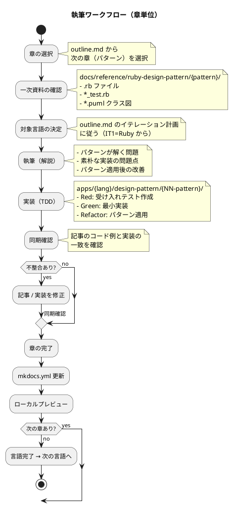
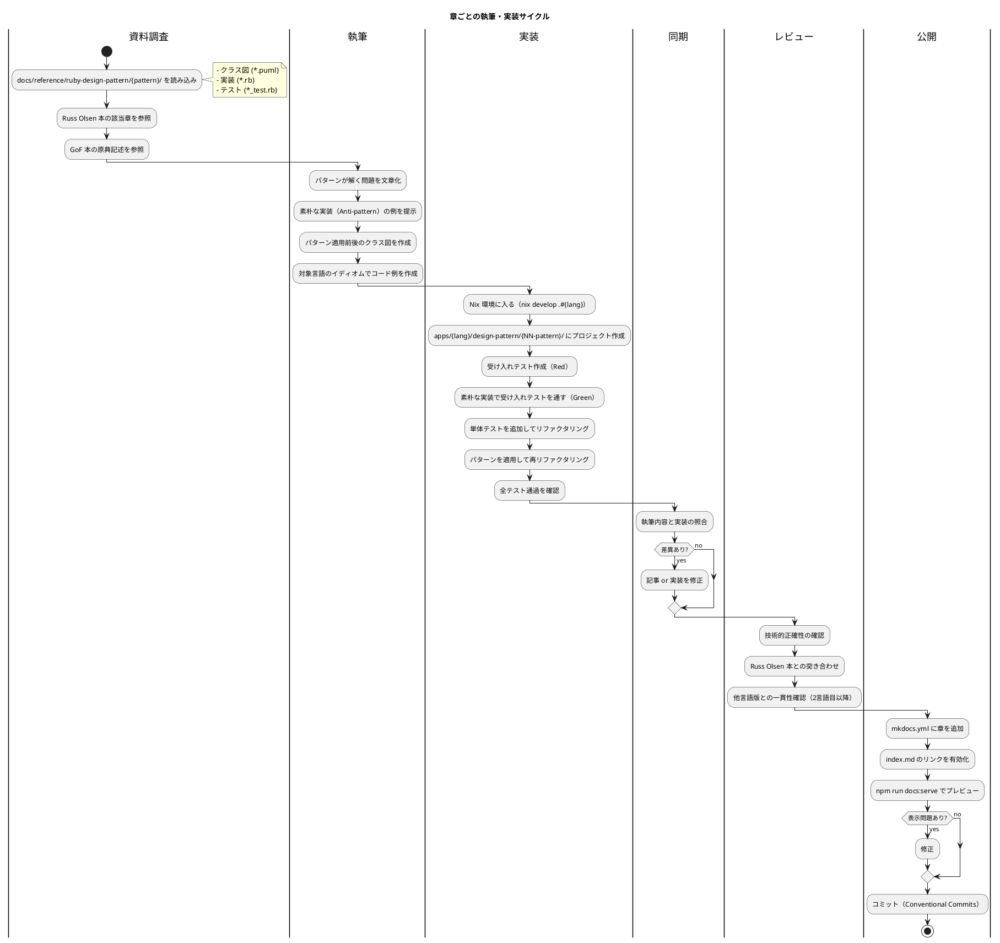
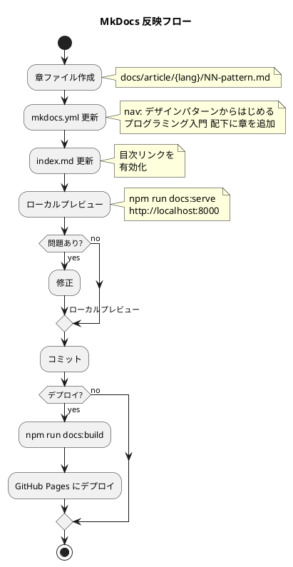

# 執筆ワークフロー

## 概要

本シリーズは `outline.md` に定義された構成に従い、章ごとに執筆と実装を同期しながら進めます。一次資料の Ruby 実装（`docs/reference/ruby-design-pattern/`）から各言語へ「翻訳」する形で、TDD によって動作を保証しながら執筆します。

## ワークフロー図



## 詳細フロー



## MkDocs 反映ワークフロー



### MkDocs 更新手順

#### 1. mkdocs.yml への章追加

```yaml
nav:
  - 記事:
      - 概要: article/index.md
      - テスト駆動開発から始めるプログラミング入門: article/getting-start-tdd/index.md
      - デザインパターンからはじめるプログラミング入門:
          - 概要: article/index.md
          - 執筆計画: article/outline.md
          - 執筆ワークフロー: article/workflow.md
          - Ruby:
              - 概要: article/ruby/index.md
              - 第 1 章 デザインパターンとパターン思考: article/ruby/01-introduction-to-patterns.md
              - 第 4 章 Template Method: article/ruby/04-template-method.md
              - ...
```

#### 2. ローカルプレビュー

```bash
# サーバー起動
npm run docs:serve

# ブラウザで確認
# http://localhost:8000
```

#### 3. ビルド・デプロイ

```bash
# 静的サイト生成
npm run docs:build
```

### MkDocs チェックリスト

- [ ] 章ファイルが正しいパスに配置されている
- [ ] mkdocs.yml の nav に章が追加されている
- [ ] index.md と outline.md のリンクが正しい
- [ ] ローカルプレビューで表示確認済み
- [ ] PlantUML クラス図が正しくレンダリングされる
- [ ] 内部リンクが正常に動作する
- [ ] コードブロックの言語タグが正しい

## 執筆ルール

### 1. 章の選択

`outline.md` のイテレーション計画に従います。

- **推奨**: 1 言語ずつ第 1〜16 章を通しで執筆し、実装も同時に完成させる
- **代替**: 1 章ずつ全言語横断で書く（同じパターンの言語間比較を即座に行いたい場合）

源流である Ruby（IT1）を最優先で完成させ、それ以降の言語は Ruby 版を参照しながら翻訳的に進めます。

### 2. 一次資料の参照

| 部 | 参照先 |
|---|---|
| 第 1 部: パターンとは何か | Russ Olsen 本 Part I、GoF 本 Chapter 1〜2 |
| 第 2 部: 振る舞いの取り扱い | `docs/reference/ruby-design-pattern/template_method`〜`Iterator` |
| 第 3 部: 操作と関係の表現 | `docs/reference/ruby-design-pattern/command`〜`decorator` |
| 第 4 部: オブジェクトの作成と解釈 | `docs/reference/ruby-design-pattern/singleton`〜`interpreter` |

### 3. 執筆フォーマット

各章は以下の構成で執筆します。

```markdown
# 第 N 章 パターン名

## N.1 解く問題

このパターンが対処する典型的な状況を提示する。可能なら、TDD 入門の文脈と
つながる例（FizzBuzz の発展形など）を選ぶ。

## N.2 素朴な実装

パターン適用前のコードを示し、変更コストや重複の問題を可視化する。

\```{lang}
// 素朴な実装
\```

## N.3 クラス図

\```plantuml
@startuml
' Russ Olsen 本のクラス図を踏襲、ただし対象言語に合わせて調整
@enduml
\```

## N.4 パターンの適用

パターンを適用した実装を示す。Ruby 素材の構造を尊重しつつ、対象言語の
イディオムに合わせて翻訳する。

### TDD サイクル

\```plantuml
@startuml
:Red: 受け入れテスト作成;
:Green: 素朴な実装で通す;
:Refactor: パターンを適用;
@enduml
\```

### 実装

<details>
<summary>実装コード（apps/{lang}/design-pattern/{NN-pattern}/ に対応）</summary>

\```{lang}
// 完成コード
\```

</details>

## N.5 言語固有の表現

このパターンを言語のイディオムでどう表現するか。代替手段（高階関数、
ジェネリクス、トレイト、メタプログラミング等）の比較も含める。

## N.6 注意点

過剰適用・誤用のリスク、いつ使わないかの判断基準。

## まとめ

- このパターンが解く問題
- パターンの本質
- 言語特性との関係
```

### 4. リスト記述の空行ルール

タスク項目や箇条書きの前に必ず空行を入れます。

- NG

  ```markdown
    **受入条件**:
    - [ ] テストが通る
    - [ ] リファクタリング済み
  ```

- OK

  ```markdown
    **受入条件**:

    - [ ] テストが通る
    - [ ] リファクタリング済み
  ```

### 5. 実装同期チェックリスト

- [ ] `apps/{lang}/design-pattern/{NN-pattern}/` にプロジェクトが作成されている
- [ ] テストコードが執筆内容と一致
- [ ] プロダクションコードが一致
- [ ] テスト実行結果が記事の記述と一致
- [ ] パターン適用前後のリファクタリングが履歴として残っている
- [ ] 記事内のコード例が `apps/{lang}/` の実コードと同期している
- [ ] Ruby 版（源流）との差分が言語イディオムで説明されている

## ファイル構成

### 記事（docs/article/）

```
docs/article/
├── index.md                          # 記事トップページ（目次）
├── outline.md                        # 執筆計画アウトライン
├── workflow.md                       # 本ファイル（執筆ワークフロー）
├── ruby/                             # Ruby（IT1: 源流）
│   ├── index.md
│   ├── 01-introduction-to-patterns.md
│   ├── 02-principles-and-patterns.md
│   ├── 03-tdd-and-tooling.md
│   ├── 04-template-method.md
│   ├── 05-strategy.md
│   ├── 06-observer.md
│   ├── 07-composite.md
│   ├── 08-iterator.md
│   ├── 09-command.md
│   ├── 10-adapter.md
│   ├── 11-proxy.md
│   ├── 12-decorator.md
│   ├── 13-singleton.md
│   ├── 14-factory.md
│   ├── 15-builder.md
│   └── 16-interpreter.md
├── java/                             # IT2
├── python/                           # IT3
├── javascript/                       # IT4: JavaScript
├── typescript/                       # IT5: TypeScript
├── csharp/                           # IT6: C#
├── fsharp/                           # IT7: F#
├── php/                              # IT8
├── go/                               # IT9
├── rust/                             # IT10
├── clojure/                          # IT11
├── scala/                            # IT12
├── elixir/                           # IT13
├── haskell/                          # IT14
└── all/                              # IT15: 多言語統合解説
    ├── index.md
    ├── 01-pattern-thinking-across-languages.md
    ├── 02-oop-vs-fp.md
    ├── 03-language-idioms.md
    └── 04-pattern-anti-patterns.md
```

### 実装コード（apps/）

```
apps/
├── ruby/
│   └── design-pattern/
│       ├── 04-template-method/
│       │   ├── lib/
│       │   ├── test/
│       │   └── Gemfile
│       ├── 05-strategy/
│       └── ...
├── java/
│   └── design-pattern/
│       └── ...
├── javascript/
│   └── design-pattern/
│       └── ...
├── typescript/
│   └── design-pattern/
│       └── ...
├── csharp/
│   └── design-pattern/
│       └── ...
├── fsharp/
│   └── design-pattern/
│       └── ...
└── ... (各言語)
```

### 記事と実装の対応関係

```
docs/article/{lang}/NN-pattern.md  ←→  apps/{lang}/design-pattern/NN-pattern/
     （記事・解説）                          （実装コード）
```

記事内のコード例は `apps/{lang}/design-pattern/{NN-pattern}/` の実コードと一致させます。実装を先に TDD で進め、動作確認済みのコードを記事に転記します。

## 開発環境

各言語の開発環境は Nix で管理します（前作 TDD 入門と共通）。

```bash
# 言語別環境に入る
nix develop .#ruby
nix develop .#java
nix develop .#node                  # JavaScript / TypeScript 共通の Node.js 環境
nix develop .#python
nix develop .#php
nix develop .#go
nix develop .#rust
nix develop .#dotnet                # C# / F# 共通の .NET SDK 環境
nix develop .#clojure
nix develop .#scala
nix develop .#elixir
nix develop .#haskell
```

### 実装の始め方

```bash
# 1. Nix 環境に入る
nix develop .#ruby

# 2. 該当パターンのディレクトリを作成
mkdir -p apps/ruby/design-pattern/04-template-method
cd apps/ruby/design-pattern/04-template-method

# 3. 言語固有のプロジェクトを初期化
#    例: Ruby の場合
#    bundle init
#    bundle add minitest

# 4. 一次資料を参考にしながら TDD サイクル開始
#    docs/reference/ruby-design-pattern/template_method/ を読み込み
#    テスト作成 → 実行（Red） → 実装（Green） → リファクタリング
```

## 進捗管理

| イテレーション | 言語 | 第 1 部 | 第 2 部 | 第 3 部 | 第 4 部 | ステータス |
|---------------|------|--------|--------|--------|--------|----------|
| IT0 | 計画策定 | — | — | — | — | ✅ 完了（本ドキュメント群） |
| IT1 | Ruby | 未着手 | 未着手 | 未着手 | 未着手 | - |
| IT2 | Java | 未着手 | 未着手 | 未着手 | 未着手 | - |
| IT3 | Python | 未着手 | 未着手 | 未着手 | 未着手 | - |
| IT4 | JavaScript | 未着手 | 未着手 | 未着手 | 未着手 | - |
| IT5 | TypeScript | 未着手 | 未着手 | 未着手 | 未着手 | - |
| IT6 | C# | 未着手 | 未着手 | 未着手 | 未着手 | - |
| IT7 | F# | 未着手 | 未着手 | 未着手 | 未着手 | - |
| IT8 | PHP | 未着手 | 未着手 | 未着手 | 未着手 | - |
| IT9 | Go | 未着手 | 未着手 | 未着手 | 未着手 | - |
| IT10 | Rust | 未着手 | 未着手 | 未着手 | 未着手 | - |
| IT11 | Clojure | 未着手 | 未着手 | 未着手 | 未着手 | - |
| IT12 | Scala | 未着手 | 未着手 | 未着手 | 未着手 | - |
| IT13 | Elixir | 未着手 | 未着手 | 未着手 | 未着手 | - |
| IT14 | Haskell | 未着手 | 未着手 | 未着手 | 未着手 | - |
| IT15 | 統合解説 | 未着手 | 未着手 | 未着手 | 未着手 | - |

進捗の更新は各章の完了時に本表を編集して反映します。

## 参照

- [執筆計画アウトライン](outline.md)
- [記事トップ](index.md)
- 一次資料: `docs/reference/ruby-design-pattern/`
- 前作: [テスト駆動開発から始めるプログラミング入門](getting-start-tdd/index.md)
