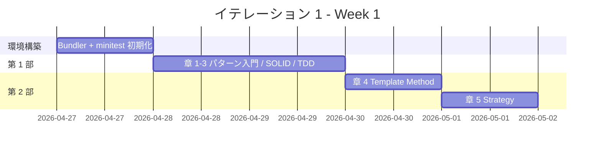
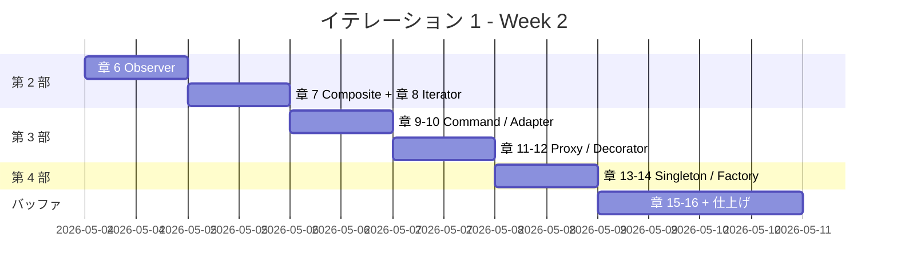
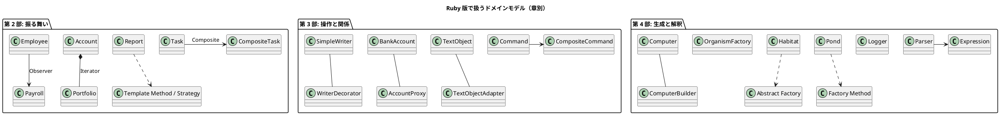

# イテレーション 1 計画 - Ruby（源流リリース）

## 概要

| 項目 | 内容 |
|------|------|
| **イテレーション** | 1 |
| **期間** | Week 1-2（2026-04-27 〜 2026-05-10、2 週間） |
| **ゴール** | 源流である Russ Olsen 本の Ruby 実装を全 16 章で再現し、後続言語の翻訳元となる完成度のドキュメントと実装を提供する |
| **目標 SP** | 16 |

> **本プロジェクト固有の注記**: 本シリーズは記事執筆プロジェクトのため、テンプレートのデータモデル / UI 設計（ビュー・モデル・インタラクション）/ API 設計 / データベーススキーマセクションは省略する。代わりに「設計」セクションでパターン解説に必要なドメインモデル例とディレクトリ構成・ADR を扱う。

---

## ゴール

### イテレーション終了時の達成状態

1. **記事**: Ruby の 16 章すべてが `docs/article/ruby/` に執筆完了
2. **実装**: `apps/ruby/design-pattern/` に TDD で実装した 13 パターンが minitest で動作する状態
3. **テンプレート**: 後続 13 言語で再利用可能な章構成・記事フォーマットが確立
4. **一次資料との対応**: `tmp/ruby-design-pattern/` の各パターンと本シリーズ記事 / 実装の対応が ADR に記録されている

### 成功基準

- [x] `docs/article/ruby/index.md` と 16 章の記事ファイルが作成済み
- [x] `apps/ruby/design-pattern/` のテストがすべてパス（75 テスト、13 パターン分）
- [x] mkdocs.yml に Ruby セクションが追加済み
- [x] テストカバレッジ 96.87%（行）/ 76.92%（ブランチ）
- [x] ADR-001 / ADR-002 が `docs/adr/` に作成されている

---

## ユーザーストーリー

### 対象ストーリー

| ID | ユーザーストーリー | SP | 優先度 |
|----|-------------------|----|----|
| US-001 | Ruby 学習者として、Russ Olsen 本のパターン実装を Ruby で読み、TDD で写経したい | 16 | 必須 |
| **合計** | | **16** | |

### ストーリー詳細

#### US-001: Ruby の デザインパターン入門記事の執筆と実装

**ストーリー**:

> Ruby 学習者として、Russ Olsen 『Design Patterns in Ruby』 で扱われている 13 パターンの実装と解説を、TDD の Red-Green-Refactor サイクルでなぞれる記事と実コードで読みたい。なぜなら、デザインパターンを「動くコード」として理解し、自分のプロジェクトに適用できる形で習得したいからだ。

**受入条件**:

1. パターン入門と SOLID 原則を Ruby で段階的に解説した第 1 部（章 1-3）が読める
2. 振る舞い系パターン 5 種（Template Method / Strategy / Observer / Composite / Iterator）が第 2 部（章 4-8）で TDD で構築できる
3. 操作と関係系パターン 4 種（Command / Adapter / Proxy / Decorator）が第 3 部（章 9-12）で TDD で構築できる
4. 生成と解釈系パターン 4 種（Singleton / Factory / Builder / Interpreter）が第 4 部（章 13-16）で TDD で構築できる
5. 記事内のコード例が `apps/ruby/design-pattern/{NN-pattern}/` の実装と一致している
6. 一次資料 `tmp/ruby-design-pattern/` との対応関係が ADR に記録されている

### タスク

#### 0. 環境構築（1 SP）

| # | タスク | 見積もり | 担当 | 状態 |
|---|--------|---------|------|------|
| 0.1 | `apps/ruby/design-pattern/` に Bundler プロジェクトを初期化（Gemfile / Rakefile） | 1.5h | AI | [ ] |
| 0.2 | minitest + simplecov のセットアップ、基本設定 | 1h | AI | [ ] |
| 0.3 | `docs/article/ruby/index.md` を作成（Ruby 版目次） | 1h | AI | [ ] |
| 0.4 | mkdocs.yml に Ruby ナビゲーションの雛形を追加 | 0.5h | AI | [ ] |

**小計**: 4h（理想時間）

#### 1. 第 1 部: パターンとは何か（3 SP）

| # | タスク | 見積もり | 担当 | 状態 |
|---|--------|---------|------|------|
| 1.1 | 章 1: デザインパターンとパターン思考 - 執筆 | 2h | AI | [ ] |
| 1.2 | 章 2: パターンを支える基本原則 - 執筆（SOLID） | 2.5h | AI | [ ] |
| 1.3 | 章 3: 開発環境と TDD 基盤 - 執筆（前作 TDD 入門 第 2 部の構成踏襲） | 2.5h | AI | [ ] |
| 1.4 | 章 1-3: 補助的なコード例（あれば apps/ruby/design-pattern/ に配置） | 1h | Codex | [ ] |

**小計**: 8h（理想時間）

**参照**: `tmp/ruby-design-pattern/README.md`、Russ Olsen 本 Part I

#### 2. 第 2 部: 振る舞いの取り扱い（4 SP）

| # | タスク | 見積もり | 担当 | 状態 |
|---|--------|---------|------|------|
| 2.1 | 章 4: Template Method - 執筆 + `04-template-method/` 実装 | 2.5h | AI + Codex | [ ] |
| 2.2 | 章 5: Strategy - 執筆 + `05-strategy/` 実装 | 2.5h | AI + Codex | [ ] |
| 2.3 | 章 6: Observer - 執筆 + `06-observer/` 実装 | 2.5h | AI + Codex | [ ] |
| 2.4 | 章 7: Composite - 執筆 + `07-composite/` 実装 | 3h | AI + Codex | [ ] |
| 2.5 | 章 8: Iterator - 執筆 + `08-iterator/` 実装 | 2.5h | AI + Codex | [ ] |

**小計**: 13h（理想時間）

**参照**: `tmp/ruby-design-pattern/template_method/` 〜 `Iterator/`

#### 3. 第 3 部: 操作と関係の表現（4 SP）

| # | タスク | 見積もり | 担当 | 状態 |
|---|--------|---------|------|------|
| 3.1 | 章 9: Command - 執筆 + `09-command/` 実装 | 3h | AI + Codex | [ ] |
| 3.2 | 章 10: Adapter - 執筆 + `10-adapter/` 実装 | 2.5h | AI + Codex | [ ] |
| 3.3 | 章 11: Proxy - 執筆 + `11-proxy/` 実装 | 3h | AI + Codex | [ ] |
| 3.4 | 章 12: Decorator - 執筆 + `12-decorator/` 実装 | 3h | AI + Codex | [ ] |

**小計**: 11.5h（理想時間）

**参照**: `tmp/ruby-design-pattern/command/` 〜 `decorator/`

#### 4. 第 4 部: オブジェクトの作成と解釈（4 SP）

| # | タスク | 見積もり | 担当 | 状態 |
|---|--------|---------|------|------|
| 4.1 | 章 13: Singleton - 執筆 + `13-singleton/` 実装 | 2.5h | AI + Codex | [ ] |
| 4.2 | 章 14: Factory（Method + Abstract）- 執筆 + `14-factory/` 実装 | 3.5h | AI + Codex | [ ] |
| 4.3 | 章 15: Builder - 執筆 + `15-builder/` 実装 | 3h | AI + Codex | [ ] |
| 4.4 | 章 16: Interpreter - 執筆 + `16-interpreter/` 実装 | 3.5h | AI + Codex | [ ] |

**小計**: 12.5h（理想時間）

**参照**: `tmp/ruby-design-pattern/singleton/` 〜 `interpreter/`

#### 5. 仕上げ（バッファ）

| # | タスク | 見積もり | 担当 | 状態 |
|---|--------|---------|------|------|
| 5.1 | mkdocs.yml に全 16 章のナビゲーション追加 | 1h | AI | [ ] |
| 5.2 | ADR-001 作成（Ruby 3.x / minitest 5.x への一次資料更新方針） | 1.5h | AI | [ ] |
| 5.3 | ADR-002 作成（パターンごとのディレクトリ分割規約） | 1h | AI | [ ] |
| 5.4 | 記事と実装の同期確認、全テスト実行、MkDocs プレビュー確認 | 2h | AI | [ ] |
| 5.5 | イテレーション完了報告書の作成（`creating-iteration-report` Skill） | 1.5h | AI | [ ] |

**小計**: 7h（理想時間）

#### タスク合計

| カテゴリ | SP | 理想時間 | 状態 |
|---------|----|----|------|
| 環境構築 | 1 | 4h | [x] |
| 第 1 部: パターンとは何か | 3 | 8h | [x] |
| 第 2 部: 振る舞いの取り扱い | 4 | 13h | [x] |
| 第 3 部: 操作と関係の表現 | 4 | 11.5h | [x] |
| 第 4 部: オブジェクトの作成と解釈 | 4 | 12.5h | [x] |
| 仕上げ（バッファ） | - | 7h | [x] |
| **合計** | **16** | **56h** | |

**1 SP あたり**: 約 3.5h（前作 TDD 入門の実績 4.4h より効率化を見込み）
**進捗率**: 100% (16/16 SP)
**想定稼働**: 60h/イテレーション（30h/週 × 2 週） → 4h バッファ余裕

---

## スケジュール

### Week 1（Day 1-5 / 2026-04-27 〜 2026-05-01）



| 日 | タスク |
|----|--------|
| Day 1 (04-27) | タスク 0.1〜0.4: 環境構築 + index.md + mkdocs.yml 雛形 |
| Day 2 (04-28) | タスク 1.1〜1.2: 章 1-2（パターン入門 / SOLID） |
| Day 3 (04-29) | タスク 1.3〜1.4: 章 3（TDD 基盤） + 補助コード |
| Day 4 (04-30) | タスク 2.1: 章 4（Template Method） |
| Day 5 (05-01) | タスク 2.2: 章 5（Strategy） |

### Week 2（Day 6-10 / 2026-05-04 〜 2026-05-08、05-09/10 はバッファ）



| 日 | タスク |
|----|--------|
| Day 6 (05-04) | タスク 2.3: 章 6（Observer） |
| Day 7 (05-05) | タスク 2.4〜2.5: 章 7-8（Composite / Iterator） |
| Day 8 (05-06) | タスク 3.1〜3.2: 章 9-10（Command / Adapter） |
| Day 9 (05-07) | タスク 3.3〜3.4: 章 11-12（Proxy / Decorator） |
| Day 10 (05-08) | タスク 4.1〜4.2: 章 13-14（Singleton / Factory） |
| バッファ (05-09/10) | タスク 4.3〜4.4: 章 15-16（Builder / Interpreter）+ 仕上げ |

---

## 設計

### ドメインモデル（参考）

各章で扱うドメインモデルは、Russ Olsen 本のサンプルを踏襲します。



### ディレクトリ構成

```
docs/article/ruby/
├── index.md
├── 01-introduction-to-patterns.md
├── 02-principles-and-patterns.md
├── 03-tdd-and-tooling.md
├── 04-template-method.md
├── 05-strategy.md
├── 06-observer.md
├── 07-composite.md
├── 08-iterator.md
├── 09-command.md
├── 10-adapter.md
├── 11-proxy.md
├── 12-decorator.md
├── 13-singleton.md
├── 14-factory.md
├── 15-builder.md
└── 16-interpreter.md

apps/ruby/design-pattern/
├── Gemfile
├── Rakefile
├── 04-template-method/
│   ├── lib/
│   ├── test/
│   └── README.md
├── 05-strategy/
├── 06-observer/
├── 07-composite/
├── 08-iterator/
├── 09-command/
├── 10-adapter/
├── 11-proxy/
├── 12-decorator/
├── 13-singleton/
├── 14-factory/
├── 15-builder/
└── 16-interpreter/
```

### ADR

| ADR | タイトル | ステータス |
|-----|---------|-----------|
| ADR-001 | Ruby 3.x / minitest 5.x への一次資料の更新方針 | 提案 |
| ADR-002 | パターンごとのディレクトリ分割（章番号 + パターン名） | 提案 |

---

## リスクと対策

| リスク | 影響度 | 対策 |
|--------|--------|------|
| 一次資料の Ruby コードが古く、minitest 仕様の変更で動かない | 高 | Day 1 の冒頭で `tmp/ruby-design-pattern/` を `bundle exec rake test` で実行確認。動かない場合は Ruby 3.x 仕様で書き直す |
| 16 章を 2 週間で完成させるペースが厳しい | 中 | 56h 計画 + 4h バッファ（60h 想定）の枠で抑える。バッファ消費時はパターンごとの「言語固有の表現」セクションを最小化 |
| 章間の構成・用語の不統一 | 中 | 第 1 部執筆時にスタイルガイドを `docs/article/ruby/index.md` に明文化 |
| MkDocs プレビューで PlantUML が正しくレンダリングされない | 低 | 既存の前作 TDD 入門でレンダリング済みのため低リスク |

---

## 完了条件

### Definition of Done

- [ ] 全 16 章の Markdown が `docs/article/ruby/` に存在する
- [ ] `apps/ruby/design-pattern/` の全テストが `bundle exec rake test` でパス
- [ ] 各章の記事内コード例が `apps/ruby/design-pattern/` の実コードと一致
- [ ] mkdocs.yml に Ruby 版ナビゲーションが追加されている
- [ ] `npm run docs:serve` で全章がプレビュー可能
- [ ] PlantUML / Mermaid 図が正しくレンダリングされる
- [ ] ADR-001 / ADR-002 が `docs/adr/` に作成されている
- [ ] イテレーション完了報告書（`creating-iteration-report` Skill 利用）が作成されている

### デモ項目

1. Ruby 版 第 4 章 Template Method の `Report` クラス継承デモ
2. Ruby 版 第 5 章 Strategy のブロックによる formatter 差し替えデモ
3. Ruby 版 第 14 章 Factory（Abstract Factory）の `Habitat` シミュレーションデモ
4. MkDocs サイトでの全章ナビゲーション確認

---

## 更新履歴

| 日付 | 更新内容 | 更新者 |
|------|---------|--------|
| 2026-04-27 | 初版作成 | k2works |
| 2026-04-27 | 整合性検証の指摘により目標 SP を 32 → 16 に圧縮、想定稼働 60h/イテレーション基準で時間配分を 36.5h → 56h に再調整（前作 TDD 入門の 1 SP ≈ 4.4h 実績ベース） | k2works |

---

## 関連ドキュメント

- [リリース計画](./release_plan.md)
- [執筆計画アウトライン](../article/outline.md)
- [執筆ワークフロー](../article/workflow.md)
- 一次資料: `tmp/ruby-design-pattern/`
- 前作: [テスト駆動開発から始めるプログラミング入門](../../tmp/getting-started-tdd/docs/article/index.md)
- [イテレーション 1 ふりかえり](./retrospective-1.md)（IT1 終了時に作成）
