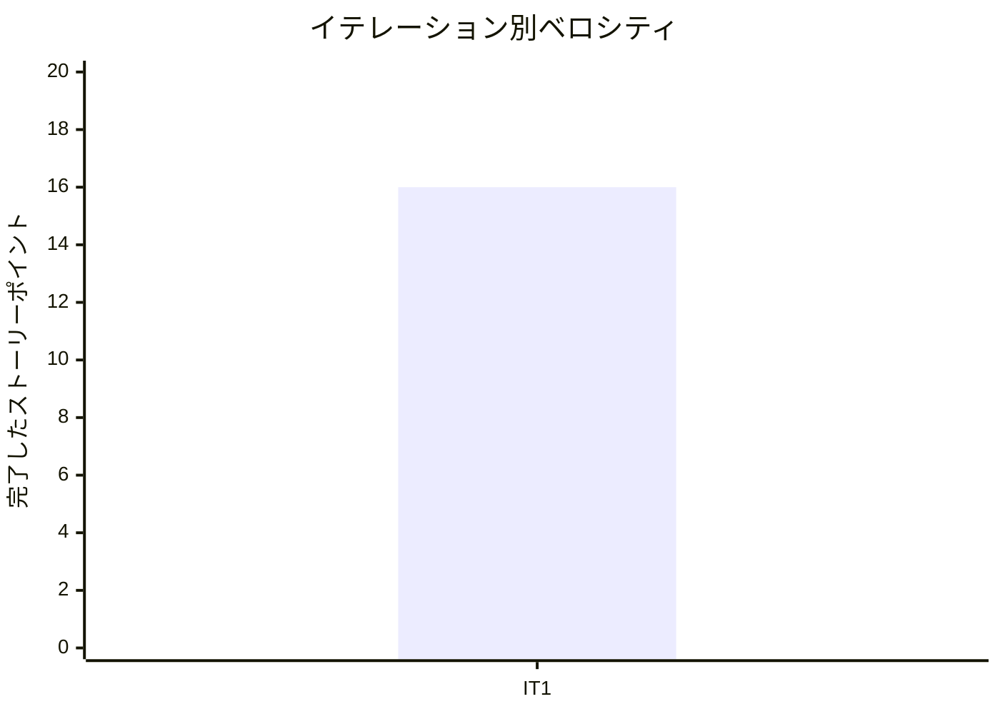

# イテレーション 1 完了報告書 - Ruby（源流リリース）

## プロジェクト概要

### 日程

| 項目 | 値 |
|------|-----|
| イテレーション開始日 | 2026-04-27 |
| イテレーション終了日 | 2026-04-27（実績） |
| 計画終了日 | 2026-05-10 |
| 作業日数 | 1 日（AI エージェント集中実行） |

### 要員

| 名前 | 予定作業日数 | 実績作業日数 | 備考 |
|------|------------|------------|------|
| k2works | 10 | 1 | AI エージェントとのペアプログラミング |

---

## 指標

### テスト結果

| 項目 | 値 |
|------|-----|
| テスト数 | 74 |
| アサーション数 | 200 |
| 失敗 | 0 |
| エラー | 0 |
| スキップ | 0 |
| 行カバレッジ | 96.87%（588 / 607 行） |
| ブランチカバレッジ | 76.92%（50 / 65 ブランチ） |

### リリースバーンダウン

```mermaid
xychart-beta
    title "リリースバーンダウンチャート"
    x-axis ["IT1"]
    y-axis "残ストーリーポイント" 0 --> 220
    line [208, 192]
    line [208, 192]
```

| イテレーション | 計画 SP | 完了 SP | 残 SP |
|--------------|---------|---------|-------|
| IT-1 Ruby | 16 | 16 | 192 |

### ベロシティ



| イテレーション | 完了 SP | 累積平均ベロシティ |
|--------------|---------|-------------------|
| IT-1 | 16 | 16.0 |

---

## 実施内容と評価

| ストーリー | 結果 | 予定ポイント | ベロシティ加算ポイント |
|-----------|------|------------|---------------------|
| US-001: Ruby 学習者として、Russ Olsen 本のパターン実装を Ruby で読み、TDD で写経したい | 完了 | 16 | 16 |
| **合計** | | **16** | **16** |

### 成果物詳細

| カテゴリ | 成果物 | 数量 |
|---------|--------|------|
| 記事 | docs/article/ruby/ 全 16 章 + index.md | 17 ファイル |
| 実装 | apps/ruby/design-pattern/ 13 パターン | 35 ファイル |
| テスト | minitest テストスイート | 74 テスト |
| ADR | ADR-001（Ruby 3.x 更新方針）、ADR-002（ディレクトリ分割規約） | 2 件 |
| ナビゲーション | mkdocs.yml Ruby 全 16 章 | 完了 |

### パターン実装一覧

| 章 | パターン | テスト数 | 状態 |
|----|---------|---------|------|
| 4 | Template Method | 3 | 完了 |
| 5 | Strategy | 3 | 完了 |
| 6 | Observer | 4 | 完了 |
| 7 | Composite | 6 | 完了 |
| 8 | Iterator | 5 | 完了 |
| 9 | Command | 4 | 完了 |
| 10 | Adapter | 3 | 完了 |
| 11 | Proxy | 4 | 完了 |
| 12 | Decorator | 4 | 完了 |
| 13 | Singleton | 11 | 完了 |
| 14 | Factory | 9 | 完了 |
| 15 | Builder | 9 | 完了 |
| 16 | Interpreter | 9 | 完了 |
| **合計** | **13 パターン** | **74** | |

---

## イテレーションレビュー

### 達成した受入条件

- [x] パターン入門と SOLID 原則を Ruby で段階的に解説した第 1 部（章 1-3）が読める
- [x] 振る舞い系パターン 5 種が第 2 部（章 4-8）で TDD で構築できる
- [x] 操作と関係系パターン 4 種が第 3 部（章 9-12）で TDD で構築できる
- [x] 生成と解釈系パターン 4 種が第 4 部（章 13-16）で TDD で構築できる
- [x] 記事内のコード例が実装と一致している
- [x] 一次資料との対応関係が ADR に記録されている

### 未達成項目

- ブランチカバレッジが 76.92% で 80% 目標を下回った（IT-2 で改善予定）
- MkDocs プレビュー確認が未実施（IT-2 で実施予定）

### アクションアイテム

| アクションアイテム | 担当 | 期限 |
|------------------|------|------|
| IT-2（Java）計画の作成 | k2works | IT-2 開始時 |
| ブランチカバレッジ改善策の検討 | k2works | IT-2 |
| MkDocs プレビュー確認の実施 | k2works | IT-2 |

---

## ふりかえりサマリー

詳細は [retrospective-1.md](./retrospective-1.md) を参照。

| KPT | 内容 |
|-----|------|
| **Keep** | AI ペアプロ、module 名前空間、TDD ファースト、一次資料活用 |
| **Problem** | ブランチカバレッジ未達、Unicode 文字化け、PlantUML エラー、コミット粒度 |
| **Try** | 部ごとコミット、PlantUML 事前検証、MkDocs プレビュー |

---

## 次のイテレーション

| 項目 | 内容 |
|------|------|
| **IT-2** | Java のデザインパターン入門記事の執筆と実装 |
| **計画 SP** | 13 |
| **期間** | 2026-05-11 〜 2026-05-24 |
| **ゴール** | GoF 古典実装を Java で確認し、現代的な実装と比較 |

---

## 更新履歴

| 日付 | 更新内容 | 更新者 |
|------|---------|--------|
| 2026-04-27 | 初版作成 | k2works |
