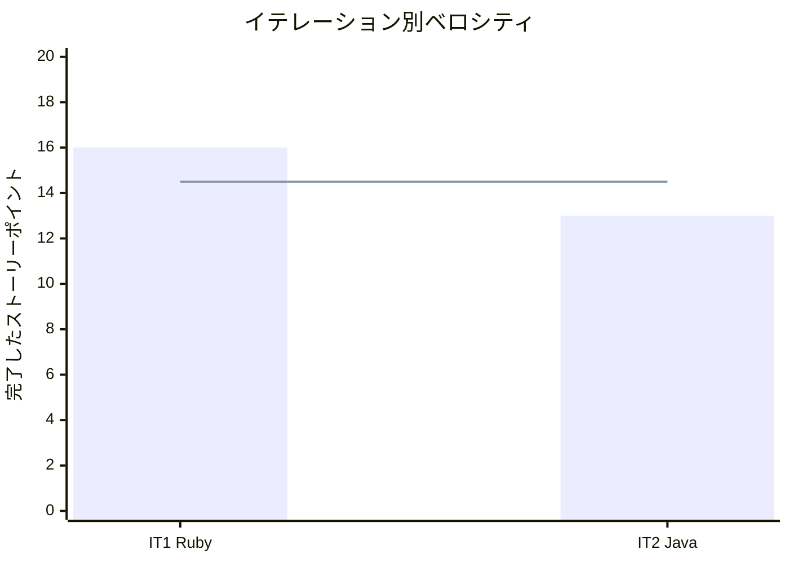

# イテレーション 2 完了報告書 - Java（GoF 古典実装）

## プロジェクト概要

### 日程

| 項目 | 値 |
|------|-----|
| イテレーション開始日 | 2026-04-27 |
| イテレーション終了日 | 2026-04-27（実績） |
| 計画終了日 | 2026-05-24 |

### 要員

| 名前 | 備考 |
|------|------|
| k2works | AI エージェントとのペアプログラミング |

---

## 指標

### テスト結果

| 項目 | 値 |
|------|-----|
| テスト数 | 76 |
| 失敗 | 0 |
| エラー | 0 |

### ベロシティ

| イテレーション | 完了 SP | 累積平均ベロシティ |
|--------------|---------|-------------------|
| IT-1 Ruby | 16 | 16.0 |
| IT-2 Java | 13 | 14.5 |

### リリースバーンダウン

| イテレーション | 完了 SP | 残 SP |
|--------------|---------|-------|
| IT-1 Ruby | 16 | 192 |
| IT-2 Java | 13 | 179 |

---

## 実施内容と評価

| ストーリー | 結果 | 予定 SP | 完了 SP |
|-----------|------|---------|---------|
| US-002: Java 開発者として、GoF 古典実装を Java で確認し、現代的な実装と比較したい | 完了 | 13 | 13 |

### 成果物

| 成果物 | 数量 |
|--------|------|
| 記事（docs/article/java/） | 17 ファイル（16 章 + index） |
| 実装（apps/java/design-pattern/） | 13 パターン |
| テスト | 76 テスト |
| CI | ci-java.yml |

### コミット履歴

| コミット | 内容 |
|---------|------|
| `6d9ac11` | Java デザインパターン開発環境を構築 |
| `6d72854` | 第 1-2 部（章 1-8）の記事と実装を追加 |
| `a3b91b5` | 第 3 部（章 9-12）の記事と実装を追加 |
| `61504f6` | 第 4 部（章 13-16）の記事と実装を追加 |
| `3010772` | IT-2 仕上げ（mkdocs ナビゲーション・計画更新） |
| `879a714` | JDK ターゲットを 17 から 21 に変更 |
| `3718b44` | Java 記事の JDK バージョンを 17 から 21 に修正 |

---

## ふりかえりサマリー

詳細は [retrospective-2.md](./retrospective-2.md) を参照。

| KPT | 内容 |
|-----|------|
| **Keep** | 部ごとコミット分割、Ruby→Java 翻訳パターン確立、テスタビリティ重視 |
| **Problem** | カバレッジ未確認、MkDocs プレビュー未実施、JDK バージョン修正漏れ |
| **Try** | カバレッジ最終確認、バージョン変更一括、3 言語比較開始 |

---

## 次のイテレーション

| 項目 | 内容 |
|------|------|
| **IT-3** | Python のデザインパターン入門記事の執筆と実装 |
| **計画 SP** | 13 |
| **ゴール** | デコレータ言語機能を活かしたパターン実装 |

---

## 更新履歴

| 日付 | 更新内容 | 更新者 |
|------|---------|--------|
| 2026-04-27 | 初版作成 | k2works |
