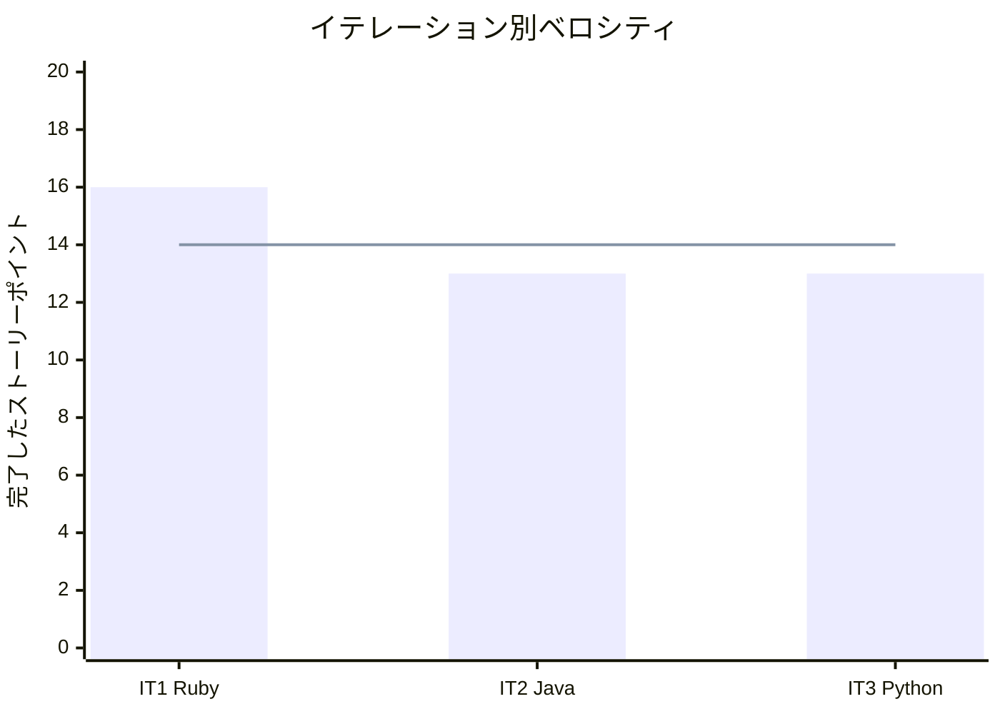

# イテレーション 3 完了報告書 - Python（デコレータ言語機能）

## 指標

| 項目 | 値 |
|------|-----|
| テスト数 | 99 |
| 失敗 | 0 |
| 完了 SP | 13 |
| 累積完了 SP | 42 / 208 |
| 残 SP | 166 |
| 累積平均ベロシティ | 14.0 SP/IT |

### ベロシティ

## 実施内容

| ストーリー | 結果 | SP |
|-----------|------|-----|
| US-003: Python デコレータ言語機能を活かしたパターン実装 | 完了 | 13 |

### 成果物

| 成果物 | 数量 |
|--------|------|
| 記事（docs/article/python/） | 17 ファイル |
| 実装（apps/python/design-pattern/src/） | 13 パターン |
| テスト | 99 テスト |
| CI | ci-python.yml |

## 次のイテレーション

| 項目 | 内容 |
|------|------|
| **IT-4** | JavaScript のデザインパターン入門記事の執筆と実装 |
| **計画 SP** | 13 |
