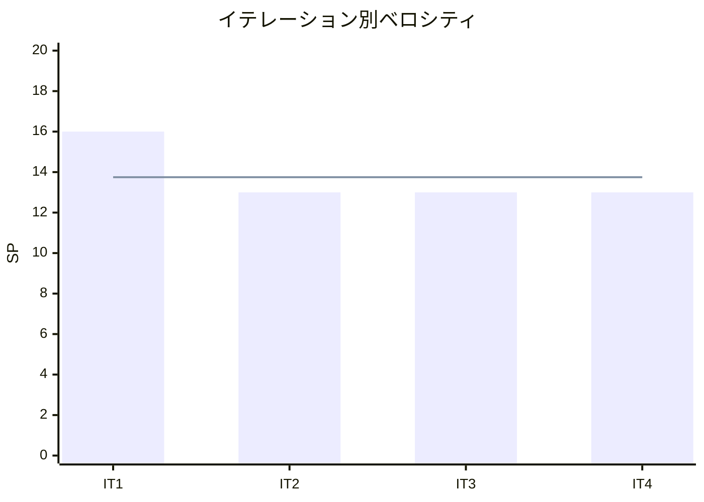

# イテレーション 4 完了報告書 - JavaScript（プロトタイプベース）

## 指標

| 項目 | 値 |
|------|-----|
| テスト数 | 82 |
| 失敗 | 0 |
| 完了 SP | 13 |
| 累積完了 SP | 55 / 208 |
| 残 SP | 153 |
| 累積平均ベロシティ | 13.75 SP/IT |

### ベロシティ

## 実施内容

| ストーリー | 結果 | SP |
|-----------|------|-----|
| US-004: JavaScript のプロトタイプベース実装 | 完了 | 13 |

### 成果物

| 成果物 | 数量 |
|--------|------|
| 記事 | 17 ファイル |
| 実装 | 13 パターン |
| テスト | 82 テスト |
| CI | ci-javascript.yml |

## 次: IT-5 TypeScript（Phase 1 最終）
