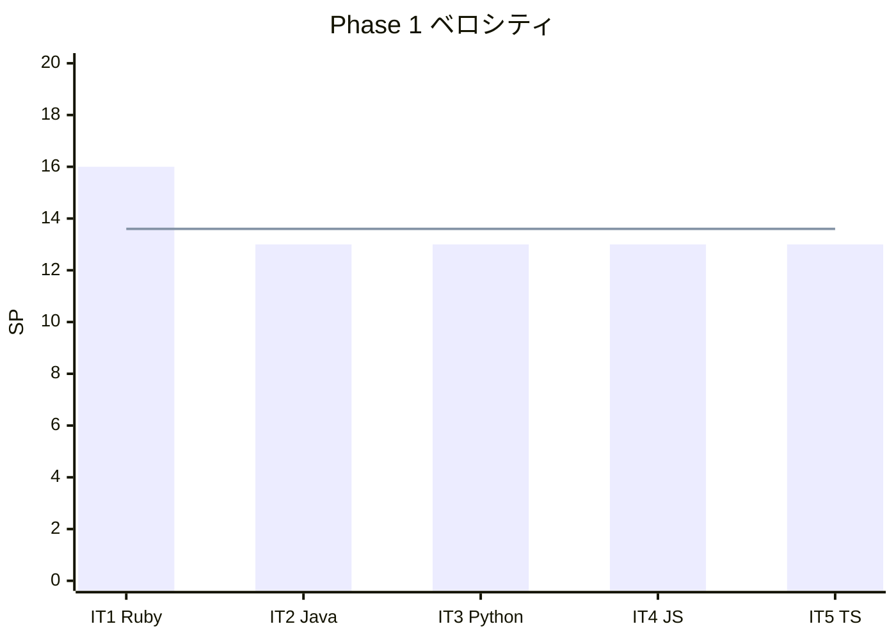

# イテレーション 5 完了報告書 - TypeScript（Phase 1 完了）

## 指標

| 項目 | 値 |
|------|-----|
| テスト数 | 75 |
| 失敗 | 0 |
| 完了 SP | 13 |
| Phase 1 累積完了 SP | 68 / 68 |
| 全体残 SP | 140 |
| 累積平均ベロシティ | 13.6 SP/IT |

### ベロシティ

## Phase 1 完了サマリー

| 言語 | テスト | 記事 | CI |
|------|--------|------|-----|
| Ruby | 74 | 17 | ci-ruby.yml |
| Java | 76 | 17 | ci-java.yml |
| Python | 99 | 17 | ci-python.yml |
| JavaScript | 82 | 17 | ci-javascript.yml |
| TypeScript | 75 | 17 | ci-typescript.yml |
| **合計** | **406** | **85** | **5 ワークフロー** |

## 次: Phase 2（IT-6〜10: C# / F# / PHP / Go / Rust）
