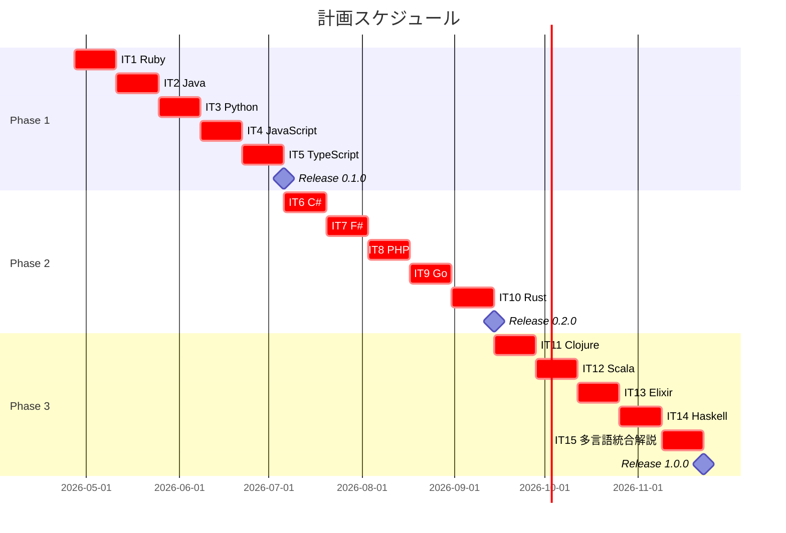
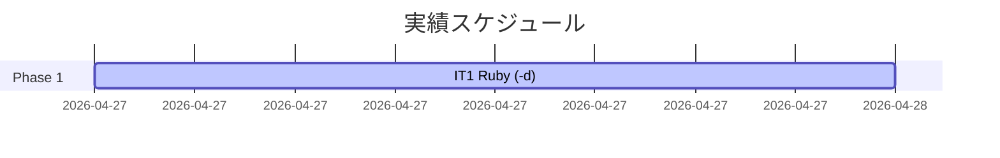

# リリース計画 - デザインパターンからはじめるプログラミング入門

## 概要

本ドキュメントは、書籍 / 記事シリーズ「デザインパターンからはじめるプログラミング入門」のリリース計画を定義します。

執筆計画の詳細は [docs/article/outline.md](../article/outline.md) と [docs/article/workflow.md](../article/workflow.md) を参照してください。SP 見積もりは前作 [getting-started-tdd の実績](../../tmp/getting-started-tdd/docs/development/release_plan.md)（12 イテレーション / 149 SP / 1 SP ≈ 4.4h）を踏襲します。

### プロジェクト情報

| 項目 | 内容 |
|------|------|
| **プロジェクト名** | デザインパターンからはじめるプログラミング入門 |
| **目的** | GoF の代表的な 13 デザインパターンを 14 言語で実装し、よいソフトウェア（変更を楽に安全にできて役に立つソフトウェア）を作るための設計の規律を実践的に学ぶ記事シリーズを完成させる |
| **対象ユーザー** | TDD の基本サイクルを習得済みのプログラマー、オブジェクト指向設計を深く理解したい開発者、関数型言語でパターンが不要になる理由を知りたい学習者 |
| **開発チーム** | 1 名 + AI コーディングエージェント（Claude Code / Codex CLI） |

---

## 満足条件

### スコープ

源流である Russ Olsen 『Design Patterns in Ruby』 を一次資料に、14 言語で全 16 章を執筆し、最後に多言語統合解説を 4 章追加します。各章の実装コードは `apps/{lang}/design-pattern/` 配下に TDD で作成し、記事と同期させます。

| フェーズ | 内容 | 言語数 |
|---------|------|--------|
| Phase 1 | 主流 OOP 言語（Ruby / Java / Python / JavaScript / TypeScript） | 5 言語 |
| Phase 2 | 多パラダイム言語（C# / F# / PHP / Go / Rust） | 5 言語 |
| Phase 3 | 関数型言語 + 統合解説（Clojure / Scala / Elixir / Haskell + 統合） | 4 言語 + 統合 |
| **合計** | | **14 言語 + 統合解説** |

### スケジュール

- **開発期間**: 2026-04-27 〜 2026-11-22（約 7 ヶ月、30 週間）
- **イテレーション**: 2 週間 × 15 回
- **リリース**: 段階的（0.1.0 → 0.2.0 → 1.0.0）

### リソース

- **開発者**: 1 名（AI コーディングエージェントとペアプログラミング）
- **想定稼働時間**: 30 時間/週（前作 TDD 入門の実績ベース。1 SP ≈ 4.4h）

---

## ユーザーストーリー一覧とストーリーポイント

### 優先順位マトリックス

4 軸評価で優先順位を決定します。

1. **金銭価値（BV）**: 読者にとっての学習価値・実務適用価値
2. **コスト（C）**: 執筆・実装コスト
3. **知識習得（KA）**: 著者・チームにとっての学習価値
4. **リスク軽減（RR）**: 後続言語への波及効果（雛形となる）

**SP 見積もりの基準**: 前作 TDD 入門の実績（1 言語 12 章 ≈ 10-13 SP / 1 SP ≈ 4.4h）を踏襲します。本シリーズは 16 章構成（TDD 入門の 1.33 倍）のため、**3 エピソード相当言語 = 13 SP**、**4 エピソード相当言語 / 源流 / 関数型 = 16 SP** を基準とします。

### Phase 1: 主流 OOP 言語（イテレーション 1-5）

源流の Ruby と、主要な OOP 言語（Java / Python / JavaScript / TypeScript）を完成させます。後続言語の翻訳元となる Ruby を最優先とします。

| ID | ユーザーストーリー | SP | BV | C | KA | RR | 優先度 |
|----|-------------------|----|----|---|----|----|--------|
| US-001 | Ruby 学習者として、Russ Olsen 本のパターン実装を Ruby で読み、TDD で写経したい | 16 | 高 | 高 | 高 | 高 | 必須 |
| US-002 | Java 開発者として、GoF 古典実装を Java で確認し、現代的な実装と比較したい | 13 | 高 | 中 | 中 | 高 | 必須 |
| US-003 | Python 開発者として、デコレータ言語機能を活かしたパターン実装を Python で読みたい | 13 | 高 | 低 | 中 | 中 | 必須 |
| US-004 | JavaScript 開発者として、プロトタイプベースで軽量な実装を JavaScript で読みたい | 13 | 中 | 低 | 中 | 中 | 必須 |
| US-005 | TypeScript 開発者として、ジェネリクスと型ガードを活用した実装を TypeScript で読みたい | 13 | 高 | 中 | 中 | 中 | 必須 |
| **合計** | | **68** | | | | | |

### Phase 2: 多パラダイム言語（イテレーション 6-10）

C# / F# / PHP / Go / Rust で、静的型・漸進的型・継承なし・所有権ベースの多様な OOP 表現を学びます。

| ID | ユーザーストーリー | SP | BV | C | KA | RR | 優先度 |
|----|-------------------|----|----|---|----|----|--------|
| US-006 | C# 開発者として、LINQ や拡張メソッドで簡略化されたパターン実装を C# で読みたい | 13 | 中 | 中 | 中 | 中 | 中 |
| US-007 | F# 開発者として、判別共用体と Computation Expression による FP 流の代替を F# で読みたい | 16 | 中 | 高 | 高 | 中 | 中 |
| US-008 | PHP 開発者として、漸進的型付けを活用したパターン実装を PHP で読みたい | 13 | 中 | 低 | 低 | 低 | 中 |
| US-009 | Go 開発者として、継承を使わない構造的型と埋め込みによるパターン実装を Go で読みたい | 13 | 中 | 低 | 中 | 中 | 必須 |
| US-010 | Rust 開発者として、トレイトと所有権を活かしたパターン実装を Rust で読みたい | 13 | 高 | 高 | 高 | 中 | 必須 |
| **合計** | | **68** | | | | | |

### Phase 3: 関数型言語 + 統合解説（イテレーション 11-15）

Clojure / Scala / Elixir / Haskell でパターンが言語機能で代替される様子を観察し、最後に多言語統合解説 4 章で締めくくります。

| ID | ユーザーストーリー | SP | BV | C | KA | RR | 優先度 |
|----|-------------------|----|----|---|----|----|--------|
| US-011 | Clojure 開発者として、プロトコル / マルチメソッド / 不変データによる代替実装を Clojure で読みたい | 16 | 中 | 高 | 高 | 中 | 中 |
| US-012 | Scala 開発者として、型クラスと暗黙の引数を活用した実装を Scala で読みたい | 16 | 中 | 高 | 中 | 中 | 中 |
| US-013 | Elixir 開発者として、Behaviour / プロセスを活かしたパターン実装を Elixir で読みたい | 16 | 中 | 中 | 中 | 低 | 中 |
| US-014 | Haskell 開発者として、型クラスとモナドを活かした純粋関数型実装を Haskell で読みたい | 16 | 中 | 高 | 高 | 中 | 中 |
| US-015 | 学習者として、14 言語の実装を横断比較した統合解説を読みたい | 8 | 高 | 中 | 高 | 高 | 必須 |
| **合計** | | **72** | | | | | |

### 全体サマリー

| フェーズ | ストーリーポイント | イテレーション |
|---------|-------------------|---------------|
| Phase 1 | 68 SP | 1-5 |
| Phase 2 | 68 SP | 6-10 |
| Phase 3 | 72 SP | 11-15 |
| **合計** | **208 SP** | **15 イテレーション** |

### ストーリーポイントの内訳

各言語のユーザーストーリーは以下のサブタスクで構成されます。

| サブタスク | 13 SP 言語 | 16 SP 言語 |
|-----------|-----------|-----------|
| 環境構築（apps/{lang}/design-pattern/ 初期化） | 1 SP | 1 SP |
| 第 1 部: パターンとは何か（章 1-3） | 3 SP | 3 SP |
| 第 2 部: 振る舞いの取り扱い（章 4-8） | 3 SP | 4 SP |
| 第 3 部: 操作と関係の表現（章 9-12） | 3 SP | 4 SP |
| 第 4 部: オブジェクトの作成と解釈（章 13-16） | 3 SP | 4 SP |
| **合計** | **13 SP** | **16 SP** |

統合解説（US-015）は 8 SP（4 章 × 2 SP）で構成されます。

---

## ベロシティ見積もり

### 初期ベロシティ推定

| 項目 | 値 |
|------|-----|
| **イテレーション期間** | 2 週間 |
| **チーム規模** | 1 名（+ AI エージェント） |
| **想定稼働時間** | 30 時間/週 = 60 時間/イテレーション |
| **想定ベロシティ** | 13-16 SP/イテレーション |
| **バッファ係数** | 0.8（20% バッファ） |
| **実効ベロシティ** | 10-13 SP/イテレーション |

前作 TDD 入門の実績（12 イテレーション平均 12.4 SP / 1 SP ≈ 4.4h）と整合します。

### ベロシティ検証計画

- 初回 3 イテレーション（IT1 Ruby / IT2 Java / IT3 Python）でベロシティを実測する。
- IT3 終了時点で平均ベロシティを再評価し、Phase 2 後半以降の SP を調整する。
- 言語ごとに執筆コストが異なるため、SP 見積もりは「3 エピソード相当 = 13 SP」「4 エピソード相当 / 源流 / 関数型 = 16 SP」の相対値として扱う。

---

## 段階的リリース戦略

### リリーススケジュール

#### 計画スケジュール

#### 実績スケジュール

実績は各イテレーション完了時に追記します。

### リリース内容

#### Release 0.1.0（Phase 1 完了）: 主流 OOP 言語リリース

**目標**: 源流の Ruby と主流 OOP 言語（Java / Python / JavaScript / TypeScript）の記事と実装を公開し、本シリーズの基本パターンを確立する。

**含まれる機能**:

- 5 言語 × 16 章の記事
- 5 言語の TDD 実装コード（`apps/{lang}/design-pattern/`）
- 言語別 index ページとナビゲーション
- 一次資料 `docs/reference/ruby-design-pattern/` との対応関係（Ruby 版で記録）

**リリース条件**:

- [ ] 全記事のレビュー完了
- [ ] 全言語のテストがパス
- [ ] MkDocs でプレビュー確認済み
- [ ] v0.1.0 タグ付け、CHANGELOG 生成

#### Release 0.2.0（Phase 2 完了）: 多パラダイム言語リリース

**目標**: C# / F# / PHP / Go / Rust の記事と実装を公開し、静的型・漸進的型・継承なし・所有権ベースの多様な OOP 表現を学べる状態にする。

**含まれる機能**:

- 5 言語 × 16 章の記事
- 5 言語の TDD 実装コード
- 言語横断比較が章末に追記されている

**リリース条件**:

- [ ] 全記事のレビュー完了
- [ ] 全言語のテストがパス
- [ ] MkDocs でプレビュー確認済み
- [ ] v0.2.0 タグ付け、CHANGELOG 生成

#### Release 1.0.0（Phase 3 完了）: 全体公開リリース

**目標**: 関数型言語（Clojure / Scala / Elixir / Haskell）の記事と多言語統合解説 4 章を加えて全 14 言語を完成させ、シリーズ全体を公開する。

**含まれる機能**:

- 4 言語 × 16 章の記事
- 多言語統合解説 4 章（`docs/article/all/`）
- 14 言語の横断比較
- 関数型言語ではパターンが言語機能で代替されることが示されている

**リリース条件**:

- [ ] 全記事のレビュー完了
- [ ] 全言語のテストがパス
- [ ] 統合解説の内容が全 14 言語をカバー
- [ ] 言語横断アンチパターン集（`04-pattern-anti-patterns.md`）が完成
- [ ] v1.0.0 タグ付け、CHANGELOG 生成
- [ ] パフォーマンステスト・SonarQube 品質ゲート通過

---

## バッファ戦略

### フィーチャバッファ

| フェーズ | 計画 SP | バッファ（30%） | 実効 SP |
|---------|---------|-----------------|---------|
| Phase 1 | 68 | 20 | 48 |
| Phase 2 | 68 | 20 | 48 |
| Phase 3 | 72 | 22 | 50 |
| **合計** | **208** | **62** | **146** |

### スケジュールバッファ

- **予備イテレーション**: 各 Phase 末尾に 1 週間のスケジュールバッファを確保（合計 3 週間）
- **全体バッファ**: 約 10%（30 週 → 33 週相当）

### バッファ消費ルール

1. **フィーチャバッファを先に消費**: 章ごとの追加コラム（言語固有 Tips、参考文献追加）はバッファから消化
2. **低優先度ストーリーを後回し**: PHP / Elixir のように BV が中〜低のストーリーは IT を後ろに移動
3. **スケジュールバッファは最後の手段**: Phase 末のリリース直前にのみ使用

---

## イテレーション計画概要

### イテレーション 1（Week 1-2 / 2026-04-27 〜 2026-05-10）

**ゴール**: 源流である Russ Olsen 本の Ruby 実装を全 16 章で再現し、後続言語の翻訳元となる完成度のドキュメントと実装を提供する。

**主なタスク**:

- [ ] `apps/ruby/design-pattern/` プロジェクト初期化（Bundler + minitest）
- [ ] Ruby 版 第 1〜3 章（パターン入門・SOLID・TDD 基盤）の執筆と実装雛形作成
- [ ] Ruby 版 第 4〜8 章（振る舞いパターン: Template Method / Strategy / Observer / Composite / Iterator）の執筆と実装
- [ ] Ruby 版 第 9〜12 章（操作と関係: Command / Adapter / Proxy / Decorator）の執筆と実装
- [ ] Ruby 版 第 13〜16 章（生成と解釈: Singleton / Factory / Builder / Interpreter）の執筆と実装

**目標 SP**: 16

詳細は [iteration_plan-1.md](./iteration_plan-1.md) を参照。

### イテレーション 2（Week 3-4 / 2026-05-11 〜 2026-05-24）

**ゴール**: Java 版で GoF 古典実装を完成させ、Ruby 版との差分を明示する。

**主なタスク**:

- [ ] `apps/java/design-pattern/` プロジェクト初期化（Gradle + JUnit 5）
- [ ] Java 版 16 章の執筆
- [ ] 言語横断比較（vs Ruby）セクションの追記

**目標 SP**: 13

詳細は IT2 開始時に [iteration_plan-2.md](./iteration_plan-2.md) として作成。

---

## リスク管理

### 技術リスク

| リスク | 影響度 | 発生確率 | 対策 |
|--------|--------|----------|------|
| 関数型言語（Haskell / Clojure / Scala）でパターン実装が「言語機能で消える」ため記事が成立しにくい | 高 | 中 | 各章末に「このパターンが不要になる理由」セクションを設け、言語機能との対応を明示 |
| Russ Olsen 本の Ruby 実装が古く、Ruby 3.x / minitest 5.x の最新仕様と乖離 | 中 | 高 | 一次資料を最新仕様に書き換えてから他言語に翻訳。差分を ADR に記録 |
| 言語ごとのテスティングフレームワーク差異により実装雛形コストが膨らむ | 中 | 中 | 前作 TDD 入門で構築済みの 14 言語環境を再利用 |
| F# / Elixir / Clojure の知識不足により執筆品質が低下 | 中 | 中 | AI エージェント（Claude Code）にレビューを委譲。`developing-review` Skills を活用 |

### スケジュールリスク

| リスク | 影響度 | 発生確率 | 対策 |
|--------|--------|----------|------|
| 個人開発のため執筆ペースが安定しない | 中 | 中 | 持続可能なペース原則に従い、週 30 時間を上限に固定。延長せずバッファで吸収 |
| 言語ごとの SP 見積もりがズレる | 中 | 中 | IT3 終了時にベロシティ実測値で再見積もり |
| 統合解説（IT15）の章数が膨らむ | 低 | 中 | 4 章固定。追加トピックは別記事として切り出し |

---

## 進捗管理

### メトリクス

| メトリクス | 目標 |
|-----------|------|
| ベロシティ | 10-13 SP/イテレーション |
| 実装テストカバレッジ | 80% 以上（各言語） |
| 章あたり執筆時間 | 3 時間以内（執筆 + 実装） |
| 予定達成率 | 90% 以上 |

### 進捗状況

| イテレーション | 言語 | 計画 SP | 実績 SP | 達成率 | 状態 |
|---------------|------|---------|---------|--------|------|
| IT1 | Ruby | 16 | - | - | 未着手 |
| IT2 | Java | 13 | - | - | 未着手 |
| IT3 | Python | 13 | - | - | 未着手 |
| IT4 | JavaScript | 13 | - | - | 未着手 |
| IT5 | TypeScript | 13 | - | - | 未着手 |
| IT6 | C# | 13 | - | - | 未着手 |
| IT7 | F# | 16 | - | - | 未着手 |
| IT8 | PHP | 13 | - | - | 未着手 |
| IT9 | Go | 13 | - | - | 未着手 |
| IT10 | Rust | 13 | - | - | 未着手 |
| IT11 | Clojure | 16 | - | - | 未着手 |
| IT12 | Scala | 16 | - | - | 未着手 |
| IT13 | Elixir | 16 | - | - | 未着手 |
| IT14 | Haskell | 16 | - | - | 未着手 |
| IT15 | 多言語統合解説 | 8 | - | - | 未着手 |
| **合計** | | **208** | **0** | **0%** | |

### バーンダウンチャート

| 時点 | 計画残 SP | 実績残 SP |
|------|----------|----------|
| 開始 | 208 | 208 |
| IT1 | 192 | - |
| IT2 | 179 | - |
| IT3 | 166 | - |
| IT4 | 153 | - |
| IT5 | 140 | - |
| IT6 | 127 | - |
| IT7 | 111 | - |
| IT8 | 98 | - |
| IT9 | 85 | - |
| IT10 | 72 | - |
| IT11 | 56 | - |
| IT12 | 40 | - |
| IT13 | 24 | - |
| IT14 | 8 | - |
| IT15 | 0 | - |

---

## 次のステップ

1. **IT1 Ruby 開始**: [iteration_plan-1.md](./iteration_plan-1.md) に従って Ruby 版の執筆と実装を開始する
2. **GitHub Project 同期**: `syncing-github-project` Skills を使い、本リリース計画を GitHub Issue / Milestone に反映
3. **MkDocs nav 追加**: `mkdocs.yml` に「デザインパターンからはじめるプログラミング入門」セクションを追加し、各言語の章を順次有効化

---

## 更新履歴

| 日付 | 更新内容 | 更新者 |
|------|---------|--------|
| 2026-04-27 | 初版作成（執筆計画 outline.md / workflow.md からリリース計画策定） | k2works |
| 2026-04-27 | 前作 TDD 入門の実績（149 SP / 1 SP ≈ 4.4h / 30h/週稼働）に合わせて SP を再見積もり。全体 392 SP → 208 SP に圧縮、Phase 構成を 3 フェーズの均等配分（5 + 5 + 4 言語）に再編成 | k2works |
