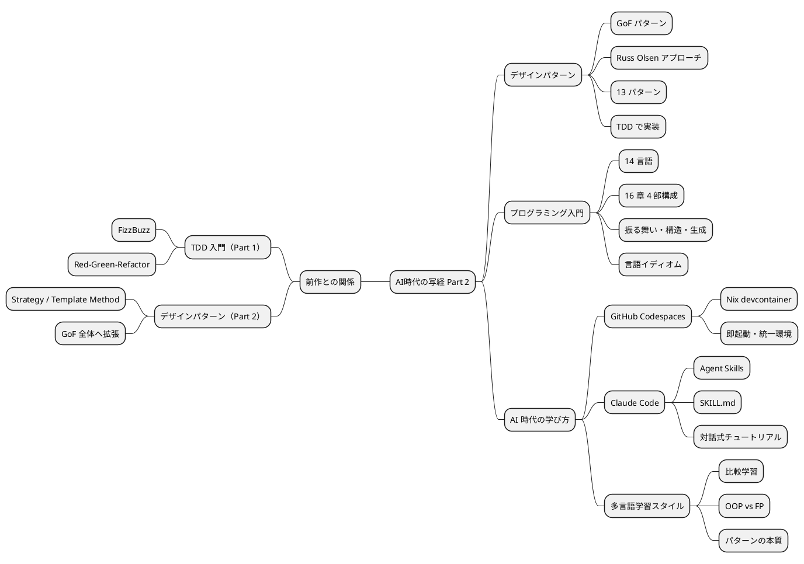
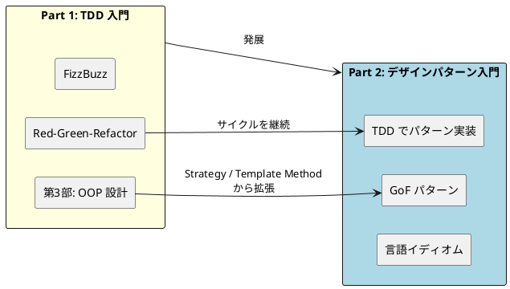
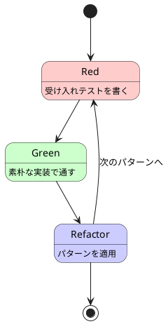
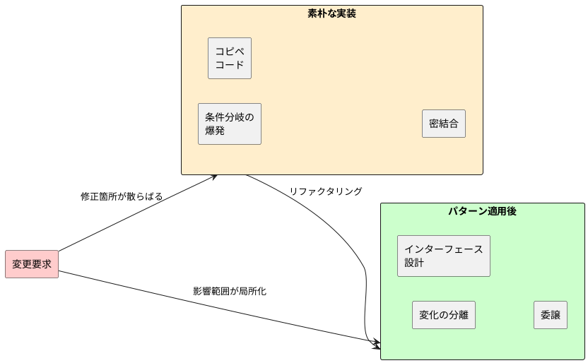
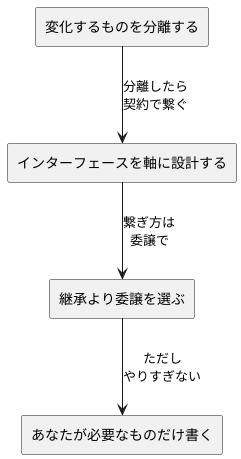
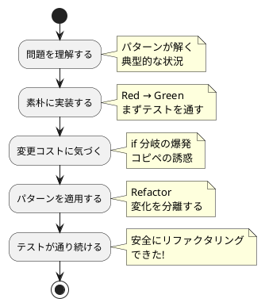
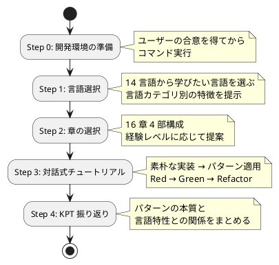
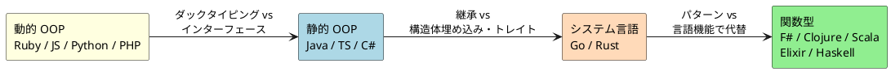
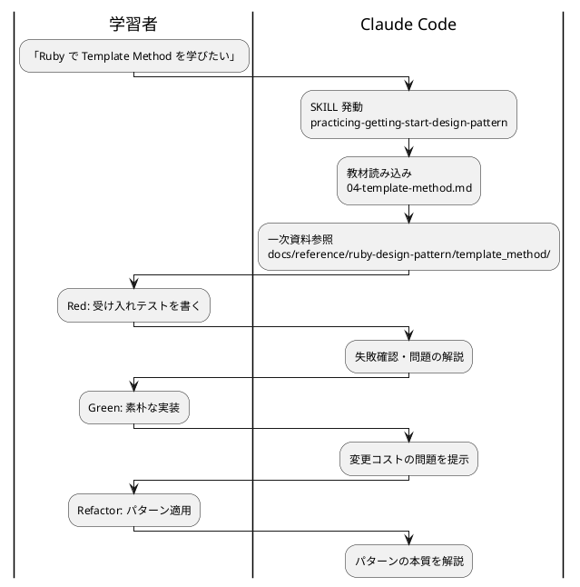

### デザインパターンからはじめるプログラミング入門 AI時代の写経 Part 2



---

### 構成

- 前作からの接続
- デザインパターンからはじめるプログラミング入門
- パターンが解く問題
- Agent Skills `practicing-getting-start-design-pattern`
- 言語カテゴリ別のアプローチ
- デモ
- まとめ

---

### 前作からの接続

前作「テスト駆動開発から始めるプログラミング入門」の続編



- Part 1 の第 3 部で触れた **Strategy / Template Method** を起点に GoF 全体へ拡張
- TDD の Red-Green-Refactor サイクルは**そのまま継続**
- 14 言語の Nix 環境とテスティング基盤を**再利用**

---

### デザインパターンからはじめるプログラミング入門

GoF デザインパターンを題材に、TDD で各言語のイディオムに沿ったパターン実装を体験するシリーズ



- Russ Olsen『Design Patterns in Ruby』をベースに、13 の GoF パターンを扱う
- **素朴な実装 → パターン適用** の Before/After でパターンの価値を体感
- 同じパターンを複数言語で実装し、**言語の設計思想がパターン表現に与える影響**を学ぶ

---

### デザインパターンからはじめるプログラミング入門 対象 14 言語

| 言語 | パターン理解の重点 |
|------|------------------|
| Ruby | 源流。ブロック、Module、メタプログラミング |
| Java | GoF 本のメインターゲット。インターフェースと継承 |
| JavaScript | プロトタイプ、関数オブジェクト、動的ディスパッチ |
| TypeScript | 静的型付け、ジェネリクス、ユニオン型 |
| Python | ダックタイピング、デコレータ言語機能 |
| PHP | 漸進的型付け、トレイト |
| Go | 構造的型、継承なしでの委譲・組み込み |
| Rust | トレイト、所有権、列挙型による多態 |
| C# / F# | OOP / 関数型ファースト |
| Clojure | プロトコル、マルチメソッド、不変データ |
| Scala | 型クラス、暗黙、パターンマッチ |
| Elixir / Haskell | プロセス / 純粋関数型 |

---

### デザインパターンからはじめるプログラミング入門 章構成

16 章 4 部構成。振る舞いパターンから始めて構造・生成・解釈へ段階的に深化

| 部 | テーマ | 章 |
|----|--------|---|
| 第 1 部 | パターンとは何か | 1. パターン思考 / 2. 基本原則 / 3. TDD 基盤 |
| 第 2 部 | 振る舞いの取り扱い | 4. Template Method / 5. Strategy / 6. Observer / 7. Composite / 8. Iterator |
| 第 3 部 | 操作と関係の表現 | 9. Command / 10. Adapter / 11. Proxy / 12. Decorator |
| 第 4 部 | 生成と解釈 | 13. Singleton / 14. Factory / 15. Builder / 16. Interpreter |

- 第 1 部で SOLID 原則と 4 つの設計原則を確認
- 第 2 部で最も基本的な振る舞いパターンから開始
- 第 3〜4 部で構造・生成系パターンと Interpreter へ

---

### パターンが解く問題

> ソフトウェアの変更コストを下げるための再利用可能な設計の知恵



- **素朴な実装**: 動くけど変更するたびに複数箇所を修正 → バグの温床
- **パターン適用後**: 変化する部分を分離し、影響範囲を最小化
- パターンは「銀の弾丸」ではなく、**変更を楽に安全にするための設計判断**

---

### パターンが解く問題 4 つの設計原則

Russ Olsen が提唱する 4 つの設計原則。GoF パターンの根底にある考え方

| 原則 | 内容 |
|------|------|
| **変化するものを分離する** | 変わる部分と変わらない部分を分ける |
| **インターフェースを軸に設計する** | 実装ではなく振る舞いの契約に依存する |
| **継承より委譲を選ぶ** | is-a より has-a。柔軟性を確保する |
| **あなたが必要なものだけ書く** | YAGNI。将来の仮定で複雑にしない |



---

### パターンが解く問題 パターンの学び方

<div class="columns">
<div>

#### 名前を覚えるより構造を理解する

- パターン名は**共通語彙**として重要
- しかし本質は「どんな問題をどう解決するか」
- TDD で**素朴な実装 → パターン適用**の Before/After を体験

#### TDD サイクルでの実装

1. **Red**: 受け入れテストを作成
2. **Green**: 素朴な実装でテストを通す
3. **Refactor**: パターンを適用してリファクタリング

</div>
<div>



</div>
</div>

---

### Agent Skills `practicing-getting-start-design-pattern`

```yaml
---
name: practicing-getting-start-design-pattern
description: 「デザインパターンからはじめるプログラミング入門」の対話式チュートリアル
---
```

#### このスキルが提供するもの

| 要素 | 内容 |
|------|------|
| 教材 | `docs/article/` 14 言語 x 16 章 |
| 一次資料 | `docs/reference/ruby-design-pattern/` Ruby 参照実装 |
| 進行 | TDD サイクルでパターンを実装 |
| 環境構築 | Codespaces / WSL+Nix / Scoop の選択肢 |
| ヒント段階 | 方向性 → 構造 → コード片 → 完全解答 |
| 振り返り | 章末で KPT（Keep / Problem / Try） |

- 「デザインパターンを学びたい」「Strategy パターンを Ruby で実装したい」と言うだけで起動
- ガイド役に徹し、コードを書くのは**ユーザー自身**

---

### Agent Skills SKILL の進行ルール



- **コード配置ルール**: `apps/{lang}/design-pattern/{NN-pattern}/` に分離
- 一次資料 `docs/reference/ruby-design-pattern/` を参照しながら各言語に翻訳

---

### Agent Skills ヒントの段階

ユーザーが詰まった場合、答えをすぐに出さず**段階的に**ヒントを出す

| 段階 | 例（Template Method パターンの場合） |
|------|------------------------------------|
| 1. 方向性 | 「変化する部分をどう分離できそうですか？」 |
| 2. 構造 | 「基底クラスにアルゴリズムの骨格を置き、具象クラスで差分を埋めるイメージです」 |
| 3. コード片 | 「`def output_line(line)` のようなフックメソッドを定義してみましょう」 |
| 4. 完全解答 | 教材のコードを提示し、なぜそのパターン構造になるかを解説 |

### 対話のトーン

- パターンの**「なぜ」**を重視する -- 名前より問題と解決の構造
- 間違いを責めず、なぜそうなるかを一緒に考える
- Russ Olsen 本や GoF 本からの引用を適宜挟み、理論的背景を伝える

---

### 言語カテゴリ別のアプローチ

言語の特性に応じてパターンの扱い方が変わる。これが多言語学習の面白さ



| カテゴリ | パターンの表現 |
|---------|--------------|
| 動的 OOP | ダックタイピング、クロージャ、メタプログラミングで**軽量に** |
| 静的 OOP | GoF 本に近い**古典的実装**。インターフェース、抽象クラス |
| システム言語 | 継承なしで**委譲・組み込み・トレイト**中心 |
| 関数型 | パターンが**言語機能に吸収される**。高階関数、ADT、パターンマッチ |

---

### 言語カテゴリ別 同じ Strategy パターンでも違う表情（Java）

```java
// Java — インターフェースで Strategy を定義
public interface Formatter {
    String outputReport(String title, List<String> text);
}

public class Report {
    private Formatter formatter;

    public Report(Formatter formatter) {
        this.formatter = formatter;
    }

    public String output() {
        return formatter.outputReport(title, text);
    }
}
```

- **インターフェース** `Formatter` でアルゴリズムの契約を定義
- コンストラクタで注入 → 実行時に差し替え可能
- GoF 本に最も近い**古典的な Strategy**

---

### 言語カテゴリ別 同じ Strategy パターンでも違う表情（Ruby）

```ruby
# Ruby — ブロックで Strategy を渡す
class Report
  def initialize(&formatter)
    @formatter = formatter
  end

  def output
    @formatter.call(@title, @text)
  end
end

report = Report.new { |title, text|
  # HTML 形式で出力
  "<h1>#{title}</h1>#{text.map { |l| "<p>#{l}</p>" }.join}"
}
```

- インターフェース不要。**ブロック / Proc** がそのまま Strategy になる
- ダックタイピングにより、`call` に応答すれば何でも OK
- 言語機能がパターンの**ボイラープレートを吸収**している

---

### 言語カテゴリ別 同じ Strategy パターンでも違う表情（Haskell）

```haskell
-- Haskell — 関数そのものが Strategy
type Formatter = String -> [String] -> String

outputReport :: Formatter -> String -> [String] -> String
outputReport formatter title text = formatter title text

htmlFormatter :: Formatter
htmlFormatter title text =
  "<h1>" ++ title ++ "</h1>" ++
  concatMap (\l -> "<p>" ++ l ++ "</p>") text
```

- **Strategy パターンは不要** -- 関数を引数で渡すだけ
- 型エイリアス `Formatter` がドキュメントの役割
- GoF パターンが**言語機能に溶け込む**典型例

---

### 言語カテゴリ別 GoF パターンと関数型代替

関数型言語では「パターンが不要 / 言語機能で代替される」ことを率直に示す

| GoF パターン | 関数型での代替 |
|--------------|---------------|
| Strategy | 高階関数（関数を引数で渡す） |
| Template Method | 高階関数 + 部分適用 |
| Observer | リアクティブストリーム / Pub-Sub プロセス |
| Iterator | 遅延シーケンス / Stream |
| Command | 関数のデータ化 |
| Singleton | モジュール / トップレベル束縛 |
| Decorator | 関数合成 |
| Interpreter | 代数的データ型 + パターンマッチ |

- パターンの**本質**は変わらない。表現形式が言語によって変わる
- 「このパターンは FP ではこう書く」という**比較視点**が理解を深める

---

### デモ

`practicing-getting-start-design-pattern` SKILL を使ったチュートリアル体験

<div class="columns">
<div>

#### デモ内容

1. **環境準備**: Codespaces 起動 → `nix develop .#ruby`
2. **SKILL 発動**: 「デザインパターンを Ruby で学びたい」
3. **章選択**: 第 4 章「Template Method」
4. **問題理解**: レポート出力の変更コスト問題
5. **Red**: 受け入れテストを書く
6. **Green**: 素朴な実装でテストを通す
7. **Refactor**: Template Method パターンを適用
8. **KPT 振り返り**

</div>
<div>



</div>
</div>

---

### まとめ

- **デザインパターンは変更コストを下げる設計の知恵** -- 「名前を覚える」より「問題と解決を理解する」
- **TDD でパターンを実装** = 素朴な実装 → パターン適用の Before/After を体感
- **言語がパターン表現を変える** -- 同じ Strategy が Java ではインターフェース、Ruby ではブロック、Haskell では関数
- **SKILL 化されたノウハウ** -- 進行ルール・ヒント段階・KPT が再現可能
- **前作 TDD 入門の自然な発展** -- Red-Green-Refactor のサイクルは継続

---

### まとめ Part 1 と Part 2 の関係

| 観点 | Part 1: TDD 入門 | Part 2: デザインパターン入門 |
|------|-----------------|---------------------------|
| 題材 | FizzBuzz | GoF 13 パターン |
| 章構成 | 12 章 4 部 | 16 章 4 部 |
| 学びの中心 | Red-Green-Refactor サイクル | 素朴な実装 → パターン適用 |
| OOP | カプセル化・SOLID（第 3 部） | GoF パターン全体に拡張 |
| FP | 高階関数・不変データ（第 4 部） | パターンの関数型代替を比較 |
| 共通基盤 | Nix 環境 + テスティング | Part 1 の基盤をそのまま再利用 |

---

### まとめ ただし...

- **コードを書くのはユーザー自身**
  AI は「教える」のではなく「一緒に学ぶ」姿勢で進む
- **パターンは銀の弾丸ではない**
  過剰適用・誤用のリスクを常に意識する。YAGNI の原則を忘れない
- **パターンの本質は言語を超える**
  Java のインターフェースも Ruby のブロックも Haskell の関数も、解いている問題は同じ
- **規律が「変更を楽に安全にできて役に立つ」よいソフトウェアを作る**
  TDD + デザインパターンはその核心

> パターンは手段。目的は**変更を楽に安全にする**こと。

---

### 参考

- 『Design Patterns in Ruby』 Russ Olsen
- 『Design Patterns: Elements of Reusable Object-Oriented Software』 GoF
- 『テスト駆動開発』 Kent Beck
- 『リファクタリング』 Martin Fowler
- [デザインパターンからはじめるプログラミング入門（記事シリーズ）](../../../docs/article/index.md)
- [執筆計画アウトライン](../../../docs/article/outline.md)
- [SKILL.md（practicing-getting-start-design-pattern）](../../../.claude/skills/practicing-getting-start-design-pattern/SKILL.md)

---
